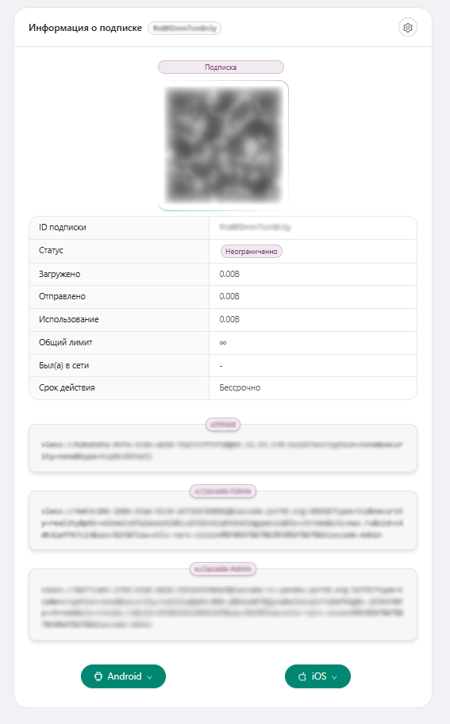

  <picture>
    <source media="(prefers-color-scheme: dark)" srcset="./media/3x-ui-dark.png">
    
  </picture>

**3X-UI** — advanced, open-source web-based control panel designed for managing Xray-core server. It offers a user-friendly interface for configuring and monitoring various VPN and proxy protocols.

> [!IMPORTANT]
> This project is only for personal usage, please do not use it for illegal purposes, and please do not use it in a production environment.

As an enhanced fork of the original X-UI project, 3X-UI provides improved stability, broader protocol support, and additional features.

## Quick Start
<pre>
<code>
  git clone https://github.com/ShkrvEr/3x-ui && cd 3x-ui && mkdir -p x-ui && cp .env.example .env && go build -o x-ui/main main.go && cd x-ui && ./main
</code>
</pre>

OR

  Create a directory named <code>x-ui</code> in the project root  
  Rename <code>.env.example</code> to <code>.env</code>   
  Run <code>main.go</code>  

  <picture>
    <source media="(prefers-color-scheme: dark)" srcset="./media/eg2.png">
    
  </picture>

For full documentation, please visit the [project Wiki](https://github.com/MHSanaei/3x-ui/wiki).
